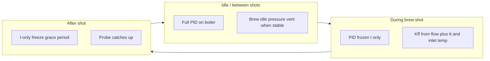

# Thermal tuning: Kff feedforward and PID freeze

How this fork handles boiler temperature during shots on my **Iberital Express** (Gaggimate PCB v1.1). For why I did this, see [this-fork.md](this-fork.md).

## Hardware context (this machine)

- **Grinder:** Base-5 scale (e.g. 5.3 → 5.4 → … → 6.0), **8 µm per tick**.
- **Dose cap:** **16 g** maximum (18 g contacts the group head).
- **Heater element:** **1000 W** (final value for this machine). Disturbance Kff scale uses `combinedKff = 1000 / wattage` → **1.0** at 1000 W when set in the PID CSV or via autotune wattage field.

These limits guide dial-in; only the heater wattage and Settings below affect firmware defaults on a fresh flash.

## Where the probe sits

The boiler temperature sensor sits at the **top-left of the boiler**, near the **cold-water inlet** — a localized cold spot. Incoming refill passes the probe before the bulk of the boiler mixes.

**Implication:** Live `ct` on shot charts is **post-hoc**. During flow the controller **does not apply new P or D from the probe** (see freeze below).

## Problem vs fix (read this first)

|                       | **Before this fork (full PID during flow)** | **With freeze + Kff**                                                           |
| --------------------- | ------------------------------------------- | ------------------------------------------------------------------------------- |
| **During shot**       | Probe reads low → PID keeps adding heat     | **I latched** + **Kff**; P/D **updates frozen**                                 |
| **Graph during flow** | Often looks too cold (probe lags)           | Same lag — expected; not proof Kff is wrong                                     |
| **After shot**        | PID still reacting → **overshoot** common   | **I-only grace**, no Kff; PID **updates still frozen**                          |
| **Spike after shot**  | PID + lag + prior heat                      | If spike **above target** → **Kff too strong during shot**, not “PID overshoot” |

**PID is never “disabled.”** During flow and grace, **P and D stop updating** from the probe; output uses a **latched I baseline** plus (during flow only) **Kff**.

**Grace is not there to “finish Kff’s job.”** It holds I steady so **PID cannot over-correct** while the probe catches up. If temperature **shoots above target** after flow stops, that excess heat was put in **during the shot by Kff** — reduce Kff gain or lower profile `tt`.



| Phase                      | Heater control                              | What the probe shows                                                     |
| -------------------------- | ------------------------------------------- | ------------------------------------------------------------------------ |
| Idle / preheat             | Full PID toward setpoint                    | Tracks boiler; cold spot at inlet when refilling                         |
| During shot (pump flowing) | **I latched** + **Kff**; P/D updates frozen | Often reads **low** (lags stream) — expected; not used for new P/D       |
| After shot (grace period)  | **Same I latched**; Kff off; P/D frozen     | Should settle toward target; **spike above target → Kff was too strong** |
| After grace                | Full PID resumes                            | Stabilized `ct` best retrospective guess at temperature during flow      |

## PID freeze — not “PID off”

When pump flow starts (with stable pre-shot **I**), the controller **latches I** as `frozenPidSum` (`captureFrozenFeedback()` in [`SimplePID.cpp`](../lib/NayrodPID/src/SimplePID/SimplePID.cpp) stores **`Ki × integral` only**).

While frozen:

- **P and D stop updating** from the probe — they do not add new correction during flow or grace.
- Output = **held I baseline + Kff** during flow; **held I only** during grace (`frozenPidSum + DistFFOut`, then `frozenPidSum` alone).
- **Integral is not accumulating** from the lying probe during flow; the **I value** was captured when the boiler was stable before the shot.

Upstream had a **Kff safety taper** that reduced feedforward when temp was near setpoint. This fork **removed it** — during flow, Kff must respond to incoming water without being scaled down. That is independent of PID freeze: PID updates are already frozen then.

## Kff during shots

When pump flow is active, `kffEnabled` is on, and `combinedKff > 0`:

- **Flow rate** (ml/s from pump model at 1 / 9 bar — calibrate in Settings)
- **Target temperature** (`tt` from the active profile phase)
- **Incoming water temperature** (`incomingWaterTempC` — Settings or brew screen ±)

Kff compensates for `(setpoint − inlet) × flow`. **Exit temperature at the puck is unknown.**

### Incoming water temp — setting and limit

You can set **Water inlet temperature** in web Settings or with **±** on the brew screen (`incomingWaterTempC`, default **23 °C**, clamp 5–40 °C).

**Problem:** On this machine, water **runs through the plumbing before the boiler inlet** and is **already warmer** than room or tap temp. A fixed value makes **Kff systematically wrong** (often over-heats if you assume colder inlet than reality).

**Fix:** A **dedicated inlet temperature probe** (planned mod in [this-fork.md](this-fork.md)). Until then, tune `incomingWaterTempC` by trial or accept error; lowering profile **`tt`** (e.g. at “The Drop”) remains the main lever against flash-heating.

### Kff flash and astringency

Fixed inlet temp cannot track real-time changes. Kff may over- or under-deliver during extraction.

**Main tuning lever during a shot: profile `tt`, not probe `ct`.**

To reduce scorching / astringency, drop **`tt` at pre-infusion or “The Drop”** (e.g. to **~88 °C**) so Kff output drops during main extraction while the probe still lags.

## Stable temperature before brew and vent

Vent and **Ready to brew** require **stable** boiler temp (`stableOffsetC` + `stableDurationMs` in Settings).

While not stable, the brew screen shows **stabilizing** with **↑** (heating toward target) or **↓** (cooling toward target).

**Why:** Settle **I** before the shot so the latched baseline is meaningful. During flow, **Kff** handles the disturbance; PID must not keep integrating on a cold-looking probe. After the shot, grace holds the same baseline so **PID still cannot over-correct** until the probe catches up.

## After the shot: PID freeze grace

When flow stops, **`pidFreezeGraceMs`** (default **60000**) keeps the **same latched I** (no Kff, no new P/D from probe). Brew screen: **Freeze grace**.

- **Purpose:** Prevent **PID** from adding heat based on a probe that still lags after flow stops.
- **Expected:** temperature drifts toward target and stabilizes without a large overshoot.
- **Not expected:** a sharp rise **above target** (e.g. ~94 °C when target was ~88–93 °C). That means **too much Kff during the preceding shot** — reduce **Kff gain** (fourth field in PID CSV) or lower profile **`tt`**. Grace did not cause the spike; it only held I while the excess heat from Kff reached the probe.

## Firmware and Settings variables

| Setting / variable                | NVS / default (fresh flash)    | Purpose                                                          |
| --------------------------------- | ------------------------------ | ---------------------------------------------------------------- |
| `kffEnabled`                      | `true` (`kff_en`)              | Master switch; when off, Kff sent as 0 over BLE                  |
| `incomingWaterTempC`              | **23** (`inlet_tw`)            | Fixed inlet for Kff gain; see inlet caveat above                 |
| `pidFreezeGraceMs`                | **60000** (`pid_grace`)        | Post-shot I-only freeze duration (web: seconds)                  |
| PID CSV `Kp,Ki,Kd,Kff`            | see `DEFAULT_PID` in constants | **`Kff` default 1.0** for 1000 W element (`combinedKff`)         |
| `stableOffsetC`                   | **0.4**                        | Max \|temp − setpoint\| while counting toward stable             |
| `stableDurationMs`                | **8000**                       | Time in band before stable (web: seconds)                        |
| `ventEnabled`                     | `true`                         | Idle pressure vent when stable in brew mode                      |
| `ventPressureBar`                 | **0.30**                       | Latch vent on above this bar                                     |
| `ventPressureLowBar`              | **0.01**                       | Latch vent off below this bar                                    |
| `pumpModelCoeffs` (1 bar / 9 bar) | kit-specific                   | Flow model for Kff; web fields gated on `pressureAvailable`      |
| Autotune heater wattage (web)     | **1000 W** default             | Derives Kff after autotune only; I did not autotune this machine |

**Web UI:** Settings → **Thermal feedforward (Kff)** and **Idle vent & boiler stability**.

**Display UI:** Brew screen **±** for inlet temp; dials to **0.1 °C**; stabilizing **↑ / ↓**; **Ready to brew**; **Venting...**; **Freeze grace**.

**BLE PID payload (7 fields):** `Kp,Ki,Kd,Kff,graceMs,kffEnabled,inletWaterTempC` — see [`Settings.cpp`](../src/display/core/Settings.cpp) `buildPidBlePayload()`.

## What we explored but did not ship

- **Kff lookahead** — reactive profiles; flow not predictable before valve open.
- **Gradual `tt` ramps** between phases — not in firmware yet; low value without better sensors.
- **Overshoot guard** (`freezeBlocked`) — planned, not wired.

## Shot export: `thermalSettings` (log v6+)

From firmware **shot log version 6**, the display writes a compact snapshot at **brew start** into the `.slog` header: inlet temp, `kffEnabled`, pump model flows (1 / 9 bar), and PID **`combinedKff`**. The web parser exposes this on exported JSON as:

```json
"thermalSettings": {
  "inletTempC": 23,
  "kffEnabled": true,
  "pumpFlow1Bar": 10.205,
  "pumpFlow9Bar": 5.521,
  "combinedKff": 1.0
}
```

Older `.slog` files have no `thermalSettings`; replay tools need manual inputs.

## CLI: `scripts/analyze_kff_shot.py`

Replays **disturbance Kff** per profile phase from exported shot JSON (uses sample `tt` and `fl`, same formula as `Heater::calculateDisturbanceFeedforwardGain`).

```bash
# v6+ export — settings taken from thermalSettings
python3 scripts/analyze_kff_shot.py shot-export.json

# Pre-v6 or missing snapshot
python3 scripts/analyze_kff_shot.py shot.json --inlet 25 --kff 1.0

# Two shots, compare mean Kff per phase
python3 scripts/analyze_kff_shot.py before.json after.json --compare

# Machine-readable
python3 scripts/analyze_kff_shot.py shot.json --json
```

Optional overrides: `--inlet`, `--kff`, `--flow-1bar`, `--flow-9bar`. Phases with “settle” in the name also get a **`settlePhaseCt`** summary.

## Related code

- Heater freeze and Kff: [`lib/GaggiMateController/src/peripherals/Heater.cpp`](../lib/GaggiMateController/src/peripherals/Heater.cpp)
- I-only latch: [`lib/NayrodPID/src/SimplePID/SimplePID.cpp`](../lib/NayrodPID/src/SimplePID/SimplePID.cpp)
- Settings: [`src/display/core/Settings.h`](../src/display/core/Settings.h), [`constants.h`](../src/display/core/constants.h)
- Stable temp and vent: [`src/display/core/Controller.cpp`](../src/display/core/Controller.cpp)
- Brew UI: [`src/display/ui/default/DefaultUI.cpp`](../src/display/ui/default/DefaultUI.cpp)

## See also

- [Why this repository is different](this-fork.md)
- [Brew idle pressure vent](brew-idle-pressure-vent.md)
